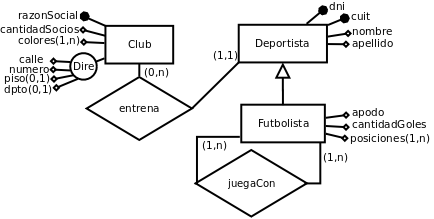

<h1 align="center"> 💿 Diseño de Base de Datos</h1>

## 📚 Teoria

- [Teorias con audio](https://drive.google.com/drive/folders/1_HfE-FjhlwMInBQoSAdSqrKD944sVSvj)
- [Libro](/Otros/Libro.pdf)
- [Resumen Teorico](/Documentos/ResumenTeorico.md)

## 🔨 Practicas

- [Ejercicio 1: WallPost]()
- [Ejercicio 2: Balanza Electrónica]()
- [Ejercicio 3: Presupuestos ]()
- [Ejercicio 3 Bis: Balanza mejorada]()
- [Ejercicio 4: Figuras y cuerpos]()
- [Ejercicio 5: Genealogía salvaje]()
- [Ejercicio 6: Red de Alumbrado ]()
- [Ejercicio 7: Method lookup con Empleados]()
- [Ejercicio 8: Distribuidora Eléctrica]()
- [Ejercicio 9: Cuenta con ganchos]()
- [Ejercicio 10: Job Scheduler]()
- [Ejercicio 11: El Inversor]()
- [Ejercicio 12: Volumen y superficie de sólidos]()
- [Ejercicio 13: Cliente de correo con adjuntos]()
- [Ejercicio 14: Intervalo de tiempo]()
- [Ejercicio 15: Alquiler de propiedades]()
- [Ejercicio 16: Políticas de cancelación]()
- [Ejercicio 17: Facturación de llamadas]()
- [Ejercicio 18: Liquidación de haberes]()
- [Ejercicio 19: Mercado de Objetos]()
- [Ejercicio 20: Farolas con focos]()

