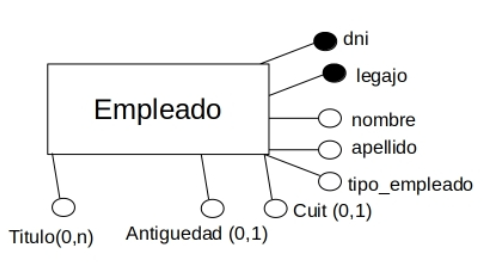
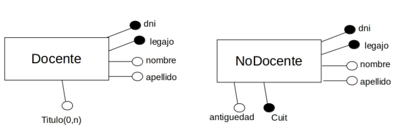
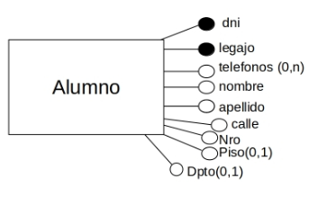
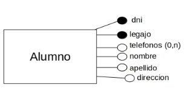
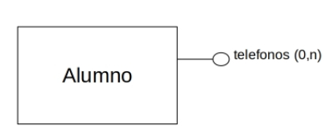
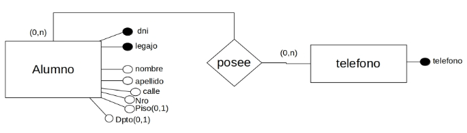

<h1 align="center"> 💿 Diseño de Base de Datos</h1>

- [Condiciones de aprobación](/Documentos/condiciones.md)
- [Modelo conceptual](#modelo-conceptual)
  - [Entidad](#entidad)
  - [Relación](#relación)
  - [Relación reculsiva](#relación-reculsiva)
  - [Atributo](#atributo)
  - [Atributo compuesto](#atributo-compuesto)
  - [Identificador](#identificador)
  - [Cardinalidades en los atributos](#cardinalidades-en-los-atributos)
  - [Cardinalidades en las relaciones](#cardinalidades-en-las-relaciones)
  - [Identificador compuesto](#identificador-compuesto)
  - [Identificador externo](#identificador-externo)
  - [Gerarquias de generalizacion](#gerarquias)
- [Modelo Logico](#modelo-logico)
  - [Resolver las Jerarquias](#resolver-las-jerarquias)
    - [Dejar Todas las entidades](#dejo-todas-las-entidades)
    - [Dejar solo al Padre](#dejar-solo-al-padre)
    - [Dejar solo a los hijos](#dejar-solo-a-los-hijosesta-opcion-solo-la-puedo-cuando-tengo-t-e)
  - [Resolver Atributos compuestos](#resolver-atributos-compuestos)
  - [Resolver Atributos Polivalentes](#resolver-atributos-polivalentes)

# Modelo conceptual
## Entidad

Es un elemento u objeto del mundo real que queremos representar. Partimos de un problema/dominio, este va a tener distintos elementos/objetos a representar y los representamos en el modelo conceptual a partir de una entidad.

---

## Relación

Nos representan las dependencias que tenemos entre dos o mas entidades, si una relacion une dos entidades, hablamos de una relacion binaria. Si une tres entidades, hablamos de una relacion ternaria y asi sucesivamente. El nombre descriptivo en la relacion **R1** no es una buena practica ya que podemos representar distintas dependencias con una misma relación (y genera ambigüedad)

---
## Relación reculsiva
Relacion que une dos entidades particulares del mismo conjunto. En este caso, materias esta relacionada con si misma. Por ejemplo R1 = 'es correlativa de', estariamos diciendo que una materia es correlativa de otra materia.

---
## Atributo

Un atributo representa una propiedad basica de una entidad o relacion. Un atributo es equivalente a un campo de un registro

---
## Atributo compuesto

Un atributo compuesto representa a un atributo generado a partir de una combinacion de varios atributos simples 

 
 

---

## Identificador

Un identificador es un atributo o un conjunto de atributos que permite reconocer o distinguir a una entidad de matenar univoca dentro del conjunto de entidades. 
- Tota entidad tiene un atributo identificador 
- Los atributos identificadores son unicamente atributos de entidades.
- Si yo encuentro un valor en mi entidad cuyo valor es unico, si o si, estoy obligado a marcarlo como atributo identificador

---
## Cardinalidades en los atributos

Los atributos, tienen asociado el concepto de cardinalidad. Cuando se define un atributo se debe indicar si es o no obligatorio y si puede tomar mas de un valor (Polivalente). En el primer parametro tenes la cardinalidad minima, y en segundo, tenes la cardinalidad maxima. 

- **Cardinalidad (1,1)** Monovalente obligatior. La cardinalidad existe y esta presenta, pero solamente en este caso no se debe indicar en forma explicita.

- **Cardinalidad (0,1)** Monovalente obligatiorio, el '0' significa que puede tomar ningun valor 

- **Cardinalidad (0, N)** Polivalente no obligatorio

- **Cardinalidad (1, N)** Polivalente Obligatorio

---
## Cardinalidades en las relaciones
Me indica el nivel de correspondencia que hay entre las dos entidades que une la relacion. Se debe definir el nivel minimo de correspondencia (cardinalidad minima), y el nivel maximo de correspondecia (cardinalidad maxima)

La cardinalidad minima, me indica que puede inscribirse a como minimo a 0 cursadas y como maximo N, es lo mismo de ambos lados.

- Toda relacion tiene cardinalidad.

---

## Identificador compuesto

Los identificadores compuestos, estan formados por varios atributos simples.

- La fecha y hora, puede repetirse en distintos examen
- Mi DNI puede repetirse en varios examenes
- Pero lo que no se puede repetir son los dos anteriores a la vez

---
## Identificador externo
- Para tener un atributo identificador externo, si o si, las dos entidades tienen que estar relacionadas
- Para que una entidad, pueda ser identificada, tiene que ser una entidad devil (tener cardinalidad 1,1)

En este caso, me indica que copia, va a ser identificado con el nro de copia , mas el identificador que me traigo de libro (que seria ISBN). 
Por lo tanto, copia va a ser identificado con nro de copia + ISBN. \
De esto puedo deducir que nro de copia se puede repetir para distintos libros pero este + el ISBN no.

---
## Gerarquias

## Generalizacion
Cuando tenemos entidades que tienen caracteristicas y propiedades comunes, podemos crear una entidad padre que junte las caracteristicas comunes, y a partir de esa entidad padre, podemos generar varias entidades hijas. Cada atributo hijo puede tener sus propios atributos/relaciones.

- El primer parametro (T o P) lo que me esta indicando en el caso de que sea total es que no existe una persona que no sea (alumno, docente o graduado). 
- Si fuera parcial, lo que me esta indicando, es lo contrario, que la suma de los elementos de los hijos, no necesariamente dan la totalidad de los elementos del padre. Podrian haber personas que no sean (alumnos, docentes o graduados).
- Segundo parametro (S o P), si es exclusiva, significa que los elementos en los hijos nunca se van a superponer, en este caso una persona es (o un alumno, o un docente, o un graduado, nunca una persona, puede ser las dos a la vez)
- Que sea superpuesta, es lo contrario, una persona puede ser alumno, docente y graduado a la vez

Coberturas
- (T, E) Total Esclusiva
- (T, S) Total SuperPuesta
- (P, E) Parcial Esclusiva
- (P, S) Parcial SuperPuesta

---
## Subconjuntos  
Caso especial de las jerarquias de generalizacion, donde se tiene una generalizacion de la que se desprende solamente una especializacion. No es necesario indicar la cobertura para los subconjuntos.

---

# Modelo Logico

## Resolver las Jerarquias
- **Total Exclusiva (T, E):** Tengo tres posibilidades, dejar los padres y los hijos (dejar todo), dejar solo los hijos eliminando al padre o dejar solo al padre, eliminando a los hijos.

En las siguientes tres, no puedo eliminar al padre, tengo las otras dos posibilidades, no puedo dejar solo a los hijos eliminando al padre.
- **Total Superpuesta (T, S):** 
- **Parcial Exclusiva (P, E):** 
- **Parcial Superpuesta (P, S):** 

### **Dejo todas las entidades.**

- Usualmente cuando dejamos todas las entidades, aparecen las relaciones **esUn**
- Recordar que no podemos tener nombres repetidos ni de entidades, ni de relaciones. (Por eso el **esUn1**)
- Tengo que mirar si los hijos tienen identificador propio, si el hijo tiene, no estoy obligado a bajar el identificador del padre. Pero si el hijo, no posee identifificador propio, estoy obligado a bajar el identificador del padre, tal y como se muestra en la imagen.
- **La cardinalidad de las relaciones:** del lado del padre, siempre va a tener **(0, 1)** y del lado del hijo, siempre va a ser **(1, 1)**

<table >
<tr>
<td>  
Conceptual
 </td> <td> 
Logico
 </td>
</tr>

 <tr>
<td>  </td> <td></td>
</tr>
 
</table>

---

### **Dejar solo al padre**

- Si dejo solo al padre, los atributos de los hijos tendran que pasar al padre (porque sino perderia esa informacion)
- **Que pasa cuando paso los atributos de los hijos al padre?** Esos atributos se vuelven opcionales. 
- Los identificadores, pasan a ser atributos opcionales

<table >
<tr>
<td>  
Conceptual
 </td> <td> 
Logico
 </td>
</tr>

 <tr>
<td>  </td> <td></td>
</tr>
 
</table>

--- 

### **Dejar solo a los hijos(Esta opcion solo la puedo cuando tengo (T, E))**

- Los atributos del padre bajan a los hijos

<table >
<tr>
<td>  
Conceptual
 </td> <td> 
Logico
 </td>
</tr>

 <tr>
<td>  </td> <td></td>
</tr>
 
</table>

--- 

## Resolver Atributos compuestos

Para resolver los atributos compuestos, tengo dos formas.
- Todos los atributos simples que conforman el atributo compuesto, bajan a la entidad
- O dejo un unico atributo que me deje un atributo simple
- Cual es la mejor opcion? Todo depende del dominio que este modelando, si yo estoy modelando un dominio cuya direccion sea un campo que es muchas veces consultado, no me conviene modelarlo todo en un atributo, porque en direccion, voy a tener que separar los datos (ya que estan todos en un atributo) y esa tarea es demasiado pesada para lo que necesitamos. En cambio si lo resolvemos como atributos individuales, tengo todos los datos mas a mano, sin necesitad de procesar nada de informacion extra.
- Si estoy modelando un dominio cuya direccion es solo un dato mas, puedo ponerlo todo en un solo atributo

<table >
<tr>
<td>  
Sólo los atributos individuales

 </td> <td> 
Todo en un solo atributo
 </td>
</tr>

 <tr>
<td> 

 </td> <td></td>
</tr>
 
</table>

## Resolver Atributos Polivalentes

<table align = 'center'>
<tr><td></td></tr>

 <tr>
 <td>

</td>
</tr>
 
</table>